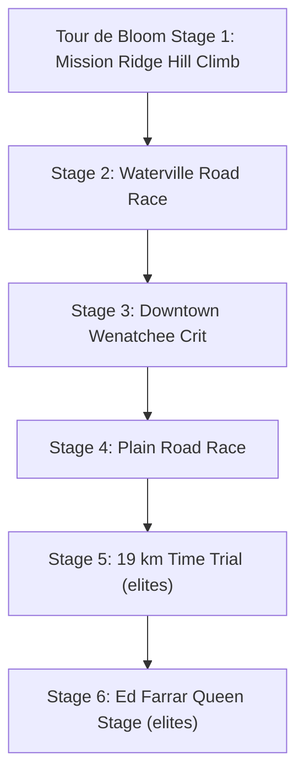
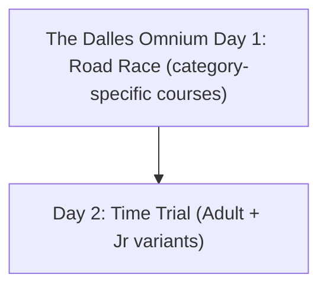
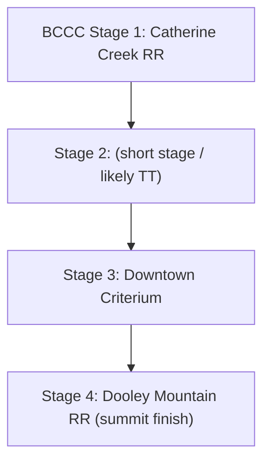

# Bicycle race research from upcoming-races-2026.md

## Executive summary

The provided list contains **20 cycling events** spanning **Mar–Jun 2026**, concentrated in the Pacific Northwest (WA/OR) and adjacent BC. Based on publicly available information, most events have a clear, authoritative web presence via **official organizer sites** (e.g., Thrashers Bike Club, Tour de Bloom, Team Oregon, Mudslinger Events) and/or **BikeReg** listings (sometimes partially inaccessible due to sign-in requirements). citeturn1view1turn1view4turn5view0turn40view0turn60view0turn71view2turn71view4

Direct course links were found for many events on **RideWithGPS** and/or **Strava**, with especially strong coverage for the multi-day events: **Tour de Bloom** (stage detail pages with distances and staging locations), **The Dalles Omnium** (official RideWithGPS course links by category and by TT day), and **Baker City Cycling Classic** (multiple stage routes on RideWithGPS). citeturn52view1turn51view4turn51view3turn49view3turn51view1turn51view2turn71view2turn72view0turn72view5turn69search2turn69search3turn69search6

Notable limitations: some **BikeReg** pages intermittently redirect to a login flow; some RideWithGPS pages were linkable but not fully readable via the crawler (still usable as direct course URLs); and at least one “course map” page (Cascade Cycling Classic) did not expose an actual map asset in the HTML snapshot (likely an embedded image or restricted content). citeturn45view0turn71view1turn72view0turn72view5

## Table of contents

- [Murchie Circuit 2026](#murchie-circuit-2026)
- [Mason Lake 1](#mason-lake-1)
- [Glen Valley RR & TT](#glen-valley-rr-tt)
- [Mason Lake 2](#mason-lake-2)
- [Jeremy's Roubaix](#jeremys-roubaix)
- [Twilight Series p/b Baddlands](#twilight-series-baddlands)
- [Aldergrove RR](#aldergrove-rr)
- [Full Speed Ahead Ravensdale Spring Classic](#ravensdale-spring-classic)
- [Murchie Mega Mix](#murchie-mega-mix)
- [Breakfast at Boston Harbor](#breakfast-at-boston-harbor)
- [Tour de Bloom](#tour-de-bloom)
- [Oregon Gran Fondo](#oregon-gran-fondo)
- [Corvallis Spring Roll](#corvallis-spring-roll)
- [Oregon Triple Crown Pass 2026](#oregon-triple-crown-pass-2026)
- [Taco Time Volunteer Park Criterium](#taco-time-volunteer-park-criterium)
- [The Dalles Omnium Day 1](#the-dalles-omnium-day-1)
- [The Dalles Omnium Full Series](#the-dalles-omnium-full-series)
- [Cascade Cycling Classic Criterium](#cascade-cycling-classic-criterium)
- [Baker City Cycling Classic](#baker-city-cycling-classic)
- [Baker City Cycling Classic Volunteer Crew](#baker-city-volunteer-crew)

## Race-by-race details

**Murchie Circuit 2026**  
Date (from provided list): Mar 14  
Year in provided list: **2026 (explicit in race name)**

| Official Site | BikeReg | Course Links | Stage details | Current DB RWGPS |
|---|---|---|---|---|
| `https://thrashersbc.ca/event/2026-murchie-circuit/` | `https://www.bikereg.com/murchie-circuit` | RideWithGPS (GPS course map): `https://ridewithgps.com/trips/252713350` | Single-day circuit race | None (no series match in DB) |

Start/finish location: **Not explicitly captured** in accessible sources; location is listed as “Murchie Circuit” via the organizer page (treat as descriptive, not a street address). citeturn1view1  

Course notes: A RideWithGPS trip exists for the race course (crawler-snippet indicates ~22.6 km and ~+142 m, but treat distance/elevation as informational until verified in the route itself). citeturn8search0

Missing/ambiguous: downloadable GPX/TCX/KML not found in accessible HTML (RideWithGPS exports may require logged-in access).

**Mason Lake 1**  
Date (from provided list): Mar 21  
Year in provided list: **Unspecified** (file context suggests 2026)

| Official Site | BikeReg | Course Links | Stage details | Current DB RWGPS |
|---|---|---|---|---|
| Unspecified / not confidently located in available sources | `https://www.bikereg.com/mason1` | Not found (no authoritative RideWithGPS/Strava/MapMyRide link located in available sources) | Single-day road race (assumed from context; verify on BikeReg) | "Mason Lake 1 and 2" (id=726): `https://ridewithgps.com/routes/53691039`; "Mason Lake Road Race" (id=13): `https://ridewithgps.com/routes/53949971` (41km, 337m, ROLLING) |

Notes about missing info: This entry likely relies on the BikeReg listing as the primary source; the BikeReg page itself was not captured in the accessible crawl set during research (so start/finish, laps, and official course map remain **unconfirmed**).

**Glen Valley RR & TT**  
Date (from provided list): Mar 21  
Year in provided list: **Unspecified** (file context suggests 2026)

| Official Site | BikeReg | Course Links | Stage details | Current DB RWGPS |
|---|---|---|---|---|
| `https://thrashersbc.ca/event/2026-glen-valley-road-race-time-trial/` | `https://www.bikereg.com/glen-valley` | RideWithGPS (RR course): `https://ridewithgps.com/trips/354370757` | Multi-event day (RR + TT); not clearly scored as a “stage race” in accessible text | None (no series match in DB) |

Course notes: A RideWithGPS trip exists tied to Glen Valley (crawler-snippet suggests ~15.7 km loop and ~+113 m). citeturn8search6  

Missing/ambiguous: A distinct TT course link was not successfully located in accessible sources; confirm in BikeReg notes or the organizer’s tech guide if published.

**Mason Lake 2**  
Date (from provided list): Mar 28  
Year in provided list: **Unspecified** (file context suggests 2026)

| Official Site | BikeReg | Course Links | Stage details | Current DB RWGPS |
|---|---|---|---|---|
| `https://www.hagensberman.com/events/mason-lake-road-race-2` | `https://www.bikereg.com/mason2` | RideWithGPS (confirmed course): `https://ridewithgps.com/routes/38753545` Strava segment (legacy reference): `https://www.strava.com/segments/12034341` | Single-day road race | "Mason Lake 2" (id=719): `https://ridewithgps.com/routes/38753545`; "Mason Lake Road Race #2" (id=602): `https://ridewithgps.com/routes/8170757` (57km, 91m, FLAT) |

Start/finish / staging: The event page identifies **start line parking** (Google Maps shortlink): `https://maps.app.goo.gl/AhZgkkyi71pV3rqAA`. citeturn5view0  

Course notes: The organizer describes a “12 mile loop” and provides a Strava segment link; the segment page itself reports distance and segment metadata. citeturn5view0turn6view0  

Missing/ambiguous: Strava segment (12034341) does not provide GPX export. Confirmed RWGPS route 38753545 is the canonical Mason Lake course.

**Jeremy's Roubaix**  
Date (from provided list): Mar 29  
Year in provided list: **Unspecified** (file context suggests 2026)

| Official Site | BikeReg | Course Links | Stage details | Current DB RWGPS |
|---|---|---|---|---|
| Local Ride Racing (race hub): `https://www.localride.ca/our-races` | `https://www.bikereg.com/racetheridge1-jun-20-apr-10` | Course map PDF (detour map): `https://local-ride.squarespace.com/s/JerRoubaix-Detour-Map-2-1.pdf` Strava route (community): `https://www.strava.com/routes/2662797` | Single-day road/gravel-style “Roubaix” event | “Jeremie's Roubaix” (id=669): None |

Authoritative “what/where” description: Cycling BC’s event listing describes the concept and basic course character (10 km loop with dyke/gravel/wood section). citeturn25search13  

Course documentation: Local Ride’s race master page lists Jeremy’s Roubaix with registration and map links (map link resolves to the PDF above). citeturn26view0turn32search1  

Missing/ambiguous: BikeReg URL in the provided list appears to use a non-obvious slug; BikeReg access may require sign-in (verify once logged in). Detour map PDF does not expose a direct GPX link in extracted text.

**Twilight Series p/b Baddlands**  
Date (from provided list): Apr 16  
Year in provided list: **2026 (explicit in race name)**

| Official Site | BikeReg | Course Links | Stage details | Current DB RWGPS |
|---|---|---|---|---|
| Event site (linked from BikeReg): `https://www.baddlands.org/Twilight%20Series.htm` | `https://www.bikereg.com/twilight-series-pb-baddlands` (resolves to BikeReg event `https://www.bikereg.com/74371`) | Strava route: `https://www.strava.com/routes/3063876250831854856` | Multi-date weekly series (6 races); treat each race date as a “series round” | “Twilight Series p/b Baddlands” (id=721): None; “Twilight Criterium” (id=20): `https://ridewithgps.com/routes/54227842` (1.0km, 5m, ROLLING) |

Series schedule and location: BikeReg lists the event as spanning **Thu Apr 16 – Fri Jun 26, 2026**, with location address and the “Event Website” link. citeturn40view0  

Course route + alternate downloads: The Strava route is public and shows distance (~1.58 mi) and includes “Export GPX/TCX” options on the route page UI. citeturn43view0  

Series rounds (from BikeReg): Race #1 (Apr 16), #2 (Apr 30), #3 (May 7), #4 (May 21), #5 (Jun 4), #6 (Jun 18). Durations vary by pack/category on BikeReg. citeturn40view0  

Missing/ambiguous: The Baddlands official site could not be opened in this environment due to encoding issues, but BikeReg provides the official site URL and course can be referenced via Strava. citeturn40view0turn41search2

**Aldergrove RR**  
Date (from provided list): Apr 18  
Year in provided list: **Unspecified** (file context suggests 2026)

| Official Site | BikeReg | Course Links | Stage details | Current DB RWGPS |
|---|---|---|---|---|
| `https://thrashersbc.ca/event/2026-aldergrove-road-race/` | `https://www.bikereg.com/aldergrove-rr` | RideWithGPS route: `https://ridewithgps.com/routes/2119103` | Single-day road race | "Aldergrove Long Road Race" (id=661): `https://ridewithgps.com/routes/38791896` (10.2km, 97m, ROLLING); "Aldergrove East Kermesse" (id=660): `https://ridewithgps.com/routes/28911744` (6.6km, 62m, ROLLING) |

Course notes: The RideWithGPS route is indexed with the name “Escape Velocity Spring Series - Aldergrove Long RR” and includes distance/elevation stats in the crawler snippet. citeturn24search0

**Full Speed Ahead Ravensdale Spring Classic**  
Date (from provided list): Apr 18  
Year in provided list: **Unspecified** (file context suggests 2026)

| Official Site | BikeReg | Course Links | Stage details | Current DB RWGPS |
|---|---|---|---|---|
| `https://www.apexracingseattle.org/ravensdale-cycling-classic` | `https://www.bikereg.com/ravensdale-2026` | RideWithGPS (community / legacy course reference): `https://ridewithgps.com/trips/1325571` | Single-day road race | "Ravensdale Road Race" (id=266): `https://ridewithgps.com/routes/53908537` (106km, 641m, ROLLING); "Ravensdale Spring Classic" (id=720): None |

Course link provenance: A RideWithGPS trip titled “Ravensdale Road Race” is indexed and provides a concrete route to reference; treat as “best available map,” not necessarily the exact 2026 championship configuration. citeturn16search0  

Notes about missing/ambiguous: The Apex page snapshot available here did not expose the “Course Map” link target (likely embedded or script-loaded). citeturn67search3turn71view3

**Murchie Mega Mix**  
Date (from provided list): Apr 25  
Year in provided list: **Unspecified** (file context suggests 2026)

| Official Site | BikeReg | Course Links | Stage details | Current DB RWGPS |
|---|---|---|---|---|
| `https://thrashersbc.ca/event/2026-murchie-mega-mix/` | `https://www.bikereg.com/murchie-mega-mix` | Road race course (RideWithGPS): `https://ridewithgps.com/trips/84635901` TT course (RideWithGPS): `https://ridewithgps.com/trips/111015075` | Multi-discipline day (RR + TT); treat as “omnium-style weekend” if scored that way (verify in tech guide) | None (no series match in DB) |

Course notes: Both RWGPS trips are indexed with distance/elevation snippet stats (Mega Mix ~19.0 km; “Southie Circuit” ~6.3 km). citeturn24search2turn24search1  

Missing/ambiguous: Scoring across RR+TT (combined vs separate) unclear from accessible text; confirm via BikeReg notes/tech guide.

**Breakfast at Boston Harbor**  
Date (from provided list): May 2  
Year in provided list: **Unspecified** (file context suggests 2026)

| Official Site | BikeReg | Course Links | Stage details | Current DB RWGPS |
|---|---|---|---|---|
| BikeReg-linked site for event series: `https://breakfastracingteam.org/boston-harbor` | `https://www.bikereg.com/breakfast-at-boston-harbor` (newer BikeReg listing appears as event `https://www.bikereg.com/74893`) | RideWithGPS route: `https://ridewithgps.com/routes/45781816` Flyer PDF (contains route link): `https://www2.obra.org/wp-content/uploads/2025/03/FINAL-Boston-Harbor-Flyer.pdf` | Single-day circuit race | "Breakfast at Boston Harbor" (id=723): `https://ridewithgps.com/routes/45929149` (49km, 410m, ROLLING); "Boston Harbor Circuit Race" (id=282): `https://ridewithgps.com/routes/554829` (10km, 68m, ROLLING) |

Start location: BikeReg event notes (as indexed) specify **Burfoot Park, 6927 Boston Harbor Rd NE, Olympia, WA 98506** as the start location, and describe the course as a ~6-mile lap with a ~100 ft climb before the finish each lap. citeturn44search0  

Course map source: The OBRA-hosted flyer explicitly includes the RideWithGPS course URL. citeturn44search2  

Missing/ambiguous: Any official GPX export link beyond RideWithGPS route page not provided explicitly.

**Tour de Bloom**  
Date (from provided list): May 14  
Year in provided list: **Unspecified** (file context suggests 2026; official site explicitly references May 14–19, 2026)

| Official Site | BikeReg | Course Links | Stage details | Current DB RWGPS |
|---|---|---|---|---|
| `https://www.tourdebloom.com/` | `https://www.bikereg.com/tour-de-bloom-26` | Stage pages (official): see stage table below Community mapping links: Strava `https://www.strava.com/routes/3233990851528525698` (labeled “Stage 1”, likely Waterville) RWGPS: `https://ridewithgps.com/routes/53849214` (Waterville, canonical 2026), `https://ridewithgps.com/routes/45882433` (crit), `https://ridewithgps.com/routes/45882468` (Plain) | **Stage race (6 stages in 2026)** | “Tour de Bloom Stage Race” (id=19): `https://ridewithgps.com/routes/27351426` (82km, 791m, ROLLING); “Tour de Bloom” (id=722): `https://ridewithgps.com/routes/52341119` (50km, 376m, ROLLING). Multiple stage entries share routes — see stage table notes |

BikeReg confirmation: The BikeReg contact page confirms the event dates as **Thu May 14 – Tue May 19, 2026** and links to the official site. citeturn60view0  

### Stage breakdown

| Stage | Official stage page | Date (official page) | Start / staging location | Distance details (as posted) | Stage-specific course link(s) | Notes | Current DB RWGPS |
|---|---|---|---|---|---|---|---|
| Stage 1 — Mission Ridge Hill Climb (mass start) | `https://www.tourdebloom.com/stage-two` | Thu May 14, 2026 | Mission Ridge Ski and Board Resort, 7500 Mission Ridge Rd, Wenatchee, WA 98801 | Mileage 4.1; Elevation Gain 1,702; Gradient 12.8% | (No official RWGPS/Strava link exposed in page text) **RWGPS (canonical 2026):** `https://ridewithgps.com/routes/49479652` (6.5km, 519m, MOUNTAINOUS) RWGPS (older community): `https://ridewithgps.com/routes/2398131` | Official stage page includes numeric distance/elevation; RWGPS link is a “best available” climb route, not guaranteed to match race start exactly. citeturn52view1turn63search2 | id=603: `routes/46520450` (81km, HILLY) — likely wrong for HC |
| Stage 2 — Waterville Road Race | `https://www.tourdebloom.com/stage-one` | Fri May 15, 2026 | Waterville High School, 200 E Birch St, Waterville, WA 98858 (plus racer parking at NCW Fair) | One lap 35.7 mi +1,413 ft; two laps 53.6 mi +2,826 ft; three laps 91.4 mi +4,239 ft | RWGPS: `https://ridewithgps.com/routes/46491966` (labeled Stage 2: Waterville) Strava (labeled Stage 1): `https://www.strava.com/routes/3233990851528525698` | Official page provides distances + parking details; mapping links are community-labeled and may reflect prior-year configurations. citeturn51view4turn58search6turn62search3 | id=671: `routes/46490366` (90km, HILLY) |
| Stage 3 — Downtown Wenatchee Criterium | `https://www.tourdebloom.com/stage-three` | Sat May 16, 2026 | Start/finish between First St and Orondo Ave, Downtown Wenatchee | Course distance 1 km, ~20 ft gain per lap; durations by category in tech guide | **RWGPS (canonical 2026):** `https://ridewithgps.com/routes/49480179` (0.9km, 6m, ROLLING) RWGPS (older): `https://ridewithgps.com/routes/45882433` | RWGPS route appears tied to a prior edition; use as a map reference unless a 2026 official link is issued. citeturn51view3turn58search11 | id=580: `routes/52341119` (50km, ROLLING) — likely wrong for crit |
| Stage 4 — Plain Road Race | `https://www.tourdebloom.com/stage-four` | Sun May 17, 2026 | Plain Cellars Winery, 18749 Alpine Acres Rd, Leavenworth, WA 98826 | One lap 24 mi +1,129 ft; two laps 48.5 mi +2,295 ft; three laps 73.3 mi +3,440 ft | **RWGPS (canonical 2026, 2 laps):** `https://ridewithgps.com/routes/54018545` (78km, 700m, ROLLING) RWGPS (older): `https://ridewithgps.com/routes/45882468` | Official page includes lap options by category; RWGPS is a best-available route reference. citeturn49view3turn62search11 | id=606: `routes/46520450` (81km, HILLY) — same as Stage 1, likely wrong |
| Stage 5 — 19 km Time Trial (elites only) | `https://www.tourdebloom.com/stage-five` | Listed as “Monday May 17th, 2026” on page (date appears inconsistent with calendar) | Parking: Lake Wenatchee Recreation Club, 14400 Chiwawa Loop Rd (start on NFD Road 62 past Humphreys Dr) | 19 km; Elevation gain 781 ft | **RWGPS (canonical 2026):** `https://ridewithgps.com/routes/53849275` (19km, 238m, HILLY) | The stage page provides staging logistics and distance, but the date text itself is inconsistent (likely a site typo). citeturn51view1 | id=729: `routes/46520450` (81km, HILLY) — same shared route, likely wrong for TT |
| Stage 6 — Ed Farrar Queen Stage (elites only) | `https://www.tourdebloom.com/stage-six` | Tue May 19, 2026 | Old Alcoa works parking lot, 6200 Malaga Alcoa Hwy | Women: 39.6 mi, 6,379 ft; Men: 57.4 mi, 8,478 ft | **RWGPS (canonical 2026):** `https://ridewithgps.com/routes/53849172` (92.4km, 2584m, MOUNTAINOUS) | Official page provides separate men’s/women’s distance & elevation. citeturn51view2 | id=730: `routes/46520450` (81km, HILLY) — same shared route, likely wrong |

Tech guide availability: The stage pages offer “PRO GUIDE / AMATEUR GUIDE” downloads; in this environment, the reachable PDF captured appears to be a **2025** technical guide (not 2026), so it should not be treated as definitive for 2026 routes. `https://a9a419b6-3289-42bc-a1c0-0201dc47a6be.filesusr.com/ugd/04b9a1_5f0f521af8154a748a5ebec936ab9b6f.pdf` citeturn55view0

**Oregon Gran Fondo**  
Date (from provided list): May 16  
Year in provided list: **Unspecified** (file context suggests 2026; official site explicitly: May 16, 2026)

| Official Site | BikeReg | Course Links | Stage details | Current DB RWGPS |
|---|---|---|---|---|
| `https://www.mudslingerevents.com/oregon-gran-fondo` | `https://www.bikereg.com/oregon-gran-fondo` (BikeReg index shows event `https://www.bikereg.com/71430`) | RWGPS (route reference): `https://ridewithgps.com/routes/14184209` On-page “Map Image 2026” link is present but target URL not exposed in extracted text | Fondo-style event (multiple route options) | "Oregon Gran Fondo" (id=499): `https://ridewithgps.com/routes/48942483` (165km, 1879m, HILLY); "Oregon Gran Fondo - Grand" (id=718): `https://ridewithgps.com/routes/7979602` (189km, 1969m, HILLY); "Oregon Gran Fondo - Medio" (id=715): `https://ridewithgps.com/routes/46893934` (115km, 1332m, HILLY) |

Event basics: The official event page states **Saturday May 16th, 2026**, Cottage Grove, OR, with start at **Bohemia Park** and start time **8:30 am** for routes, including “100, 69 mile options”. citeturn71view4turn72view7  

Course downloads: The FAQ section explicitly instructs riders to **download the GPX** by going to the RideWithGPS map and exporting, but the direct RideWithGPS map link is not exposed in this HTML snapshot. citeturn72view7  

Route link found: A RideWithGPS route titled “Oregon Gran Fondo” exists and provides a concrete map reference, but the mileage listed there (117 mi / 71) may reflect a different edition or variant; treat it as a route reference until confirmed against the 2026 “Map Image 2026”. citeturn70search3turn72view7  

**Corvallis Spring Roll**  
Date (from provided list): May 17  
Year in provided list: **Unspecified** (file context suggests 2026)

| Official Site | BikeReg | Course Links | Stage details | Current DB RWGPS |
|---|---|---|---|---|
| `https://www.corvallisspringroll.com/` | `https://www.bikereg.com/corvallis-spring-roll` | Not found | Not a race (official site describes a kids’ ride + cycle fair) | "Corvallis Spring Roll" (id=746): `https://ridewithgps.com/routes/45496132` (1.2km, 3m, FLAT) — not a race per official site |

Important clarification: The official site explicitly describes Corvallis Spring Roll as **a community bike/trike ride and cycle fair for kids** and “not a race.” citeturn65search1  

Missing/ambiguous: If the provided list intended a different competitive event with a similar name, it was not identifiable from the available sources.

**Oregon Triple Crown Pass 2026**  
Date (from provided list): Jun 6  
Year in provided list: **2026 (explicit in BikeReg slug)**

| Official Site | BikeReg | Course Links | Stage details | Current DB RWGPS |
|---|---|---|---|---|
| BikeReg-linked site: `http://oregontriplecrown.com` | `https://www.bikereg.com/oregon-triple-crown-pass-2026` (BikeReg event `https://www.bikereg.com/71427`) | Not applicable as a single course (pass covers multiple events) | Series pass spanning multiple dates | None (no series match in DB) |

BikeReg details: BikeReg presents this as a **multi-date pass** (Mar–Jul 2026), with an “Event Website” of `http://oregontriplecrown.com` and multiple pass options (3–6 events). citeturn66view1  

Series context: The Mudslinger “Oregon Triple Crown Series” page describes the series and pass concept (use this as context; each included event typically publishes its own route maps). citeturn65search6  

Missing/ambiguous: No single authoritative course link exists for the pass itself; course links live on the underlying event pages.

**Taco Time Volunteer Park Criterium**  
Date (from provided list): Jun 13  
Year in provided list: **2026 (explicit in BikeReg slug)**

| Official Site | BikeReg | Course Links | Stage details | Current DB RWGPS |
|---|---|---|---|---|
| `https://tacotimenw.bike/taco-time-volunteer-park-criterium/` | `https://www.bikereg.com/2026-taco-time-volunteer-park-crit` (indexed as BikeReg event `https://www.bikereg.com/74269`) | Not found in accessible page text (no RWGPS/Strava/MapMyRide link exposed) | Single-day criterium | "Taco Time Volunteer Park Criterium" (id=609): None; "Volunteer Park Criterium" (id=17): `https://ridewithgps.com/routes/53044893` (7km, 135m, MOUNTAINOUS) |

Event context: The official team site states the event includes the **WSBA Senior State Criterium Championship** and outlines category sequencing (but does not expose a course-link URL in the captured HTML). citeturn71view0  

BikeReg presence: BikeReg indexing indicates an event titled “Taco Time Volunteer Park Criterium” on Sat June 13, 2026. citeturn65search3  

Missing/ambiguous: Course map / GPX / Strava route not found in accessible sources; check BikeReg notes or a WSBA event flyer if published.

**The Dalles Omnium Day 1**  
Date (from provided list): Jun 13  
Year in provided list: **2026 (explicit on official site and in list text)**

| Official Site | BikeReg | Course Links | Stage details | Current DB RWGPS |
|---|---|---|---|---|
| `https://teamoregon.cc/the-dalles-omnium-2026` | `https://www.bikereg.com/the-dalles-cycling-classic` | Day 1 courses (RideWithGPS, official links): `https://ridewithgps.com/routes/53981534` (Open/Women/Masters 1/2) `https://ridewithgps.com/routes/53981794` (Open/Women/Masters 3/4) `https://ridewithgps.com/routes/53995369` (Open/Women/Masters 4/5) `https://ridewithgps.com/routes/53995311` (Juniors) | **Omnium weekend** (Day 1 Road Race; Day 2 TT) | None (no specific "Dalles" series match with RWGPS in DB) |

Staging location (Day 1): Calvary Baptist Church, **3350 Columbia View Dr, The Dalles, OR 97058**. citeturn71view2  

Course link authority: The official Team Oregon page publishes category-specific RideWithGPS course links (the RWGPS pages themselves were not readable in this environment, but the URLs are direct). citeturn71view2turn72view0turn72view3  

**The Dalles Omnium Full Series**  
Date (from provided list): Jun 13  
Year in provided list: **2026 (explicit on official site and in list text)**

| Official Site | BikeReg | Course Links | Stage details | Current DB RWGPS |
|---|---|---|---|---|
| `https://teamoregon.cc/the-dalles-omnium-2026` | `https://www.bikereg.com/the-dalles-omnium-full-series` | Day 2 TT courses (RideWithGPS, official links): `https://ridewithgps.com/routes/53981321` (Adult TT course) `https://ridewithgps.com/routes/54061841` (Younger juniors TT) | **Omnium weekend** (2 events total) | None (no specific "Dalles" series match with RWGPS in DB) |

Staging location (Day 2 TT): The Dalles SDA Church, **501 Veterans Dr, The Dalles, OR**. citeturn71view2  

Notes on downloads: Each RideWithGPS route typically allows GPX export depending on permissions/login; direct GPX/TCX/KML URLs were not exposed in the crawler output for these RWGPS pages.

**Cascade Cycling Classic Criterium**  
Date (from provided list): Jun 21  
Year in provided list: **Unspecified** (file context suggests 2026; official site explicitly: June 21, 2026)

| Official Site | BikeReg | Course Links | Stage details | Current DB RWGPS |
|---|---|---|---|---|
| `https://cascadecyclingclassic.com/` | `https://www.bikereg.com/cascade-cycling-classic-criterium` (indexed BikeReg event: `https://www.bikereg.com/73781`) | Official “Course Map” page exists but map asset not visible in captured HTML: `https://cascadecyclingclassic.com/course-map/` RideWithGPS (legacy / non-crit reference): `https://ridewithgps.com/routes/12649103` | Single-day criterium (current site framing) | "Cascade Cycling Classic" (id=618): `https://ridewithgps.com/routes/33683529` (138km, 1617m, HILLY) — historical multi-stage; "Cascade Cycling Classic Criterium" (id=733): None |

Official event branding and date: The Cascade Cycling Classic site states the criterium returns, with **June 21, 2026** in Bend, OR. citeturn67search2turn70search1  

Course map page limitation: The “Course Map” page renders without a map image/embedded object in the captured HTML (likely an embedded asset not exposed to the crawler). citeturn71view1  

Additional mapping link (use cautiously): A RideWithGPS route titled “Cascade Cycling Classic Amateur TT” exists, but it is a **time trial** and may be from a prior multi-stage era rather than the revived criterium-only format. citeturn68search6turn70search1  

**Baker City Cycling Classic**  
Date (from provided list): Jun 26  
Year in provided list: **Unspecified** (file context suggests 2026)

| Official Site | BikeReg | Course Links | Stage details | Current DB RWGPS |
|---|---|---|---|---|
| `https://www.bakercitycyclingclassic.com/` | `https://www.bikereg.com/baker-city-cycling-classic` (indexed BikeReg event: `https://www.bikereg.com/71785`) | Official RideWithGPS routes found for multiple stages (see stage table below) | **Stage race (4 stages)** | "Baker City Cycling Classic" (id=529): `https://ridewithgps.com/routes/27945531` (136km, 2406m, MOUNTAINOUS); "BCCC - Catherine Creek" (id=527): `https://ridewithgps.com/routes/45958894` (126km, 1148m, ROLLING) |

Official positioning: The race site describes multiple road races, a TT, and a downtown criterium, culminating in the 101-mile Dooley Mountain Road Race (Stage 4). citeturn67search1turn67search5  

### Stage breakdown

| Stage | Type (inferred) | Course link(s) | Notes | Current DB RWGPS |
|---|---|---|---|---|
| Stage 1 — Catherine Creek Road Race | Road race | RWGPS (official account): `https://ridewithgps.com/routes/45958894` | RWGPS route is published by “Baker City Cycling Classic” and is associated with an “upcoming event” dated June 2026. citeturn68search0turn69search2 | id=527: `routes/45958894` (126km, 1148m, ROLLING) |
| Stage 2 — (not named in available snippet) | Likely TT or short road stage | RWGPS: `https://ridewithgps.com/routes/43722746` | Indexed as “Stage 2 of the 2025 Baker City Cycling Classic” with ~11.9 mi distance; treat as a probable TT route reference pending 2026 confirmation. citeturn69search3 | id=502: `routes/27945531` (136km, 2406m, MOUNTAINOUS) — likely shared route |
| Stage 3 — Downtown Criterium | Criterium | **Not found in accessible sources** | Official site indicates a downtown criterium exists, but no authoritative RWGPS/Strava route link was located in available sources. citeturn67search1turn67search5 | id=707: `routes/27945531` — shared route, likely wrong for crit |
| Stage 4 — Dooley Mountain Road Race | Road race (summit finish) | RWGPS: `https://ridewithgps.com/routes/39662231` | Indexed as “Stage 4 of the Baker City Cycling Classic,” ~100.4 mi with heavy climbing. citeturn69search6 | id=503: `routes/27945531` (136km, 2406m, MOUNTAINOUS) — likely shared route |

Alternate mapping: A “Pocahontas Rd. Loop” RideWithGPS trip exists (`https://ridewithgps.com/trips/11400986`) and may relate to a TT corridor, but it is not labeled as an official BCCC stage in the available snippet. citeturn69search1  

**Baker City Cycling Classic Volunteer Crew**  
Date (from provided list): Jun 28  
Year in provided list: **Unspecified** (file context suggests 2026)

| Official Site | BikeReg | Course Links | Stage details | Current DB RWGPS |
|---|---|---|---|---|
| `https://www.bakercitycyclingclassic.com/` | `https://www.bikereg.com/baker-city-cycling-classic-volunteer-crew` | Not applicable (volunteer registration) | Not a race; operational/volunteer sign-up | Not applicable (volunteer registration) |

Notes: Treat as a staffing/volunteer registration page rather than a competitive event. No course links expected beyond those for the race itself. citeturn67search1  

## Stage race visual summaries

## Data gaps and ambiguities

BikeReg access is inconsistent in this environment: some events are fully readable (e.g., Twilight Series, Oregon Triple Crown Pass), while others intermittently redirect to an authentication flow, which can prevent extracting official attachments/links from the “Notes/Downloads” sections. citeturn40view0turn66view1turn45view0

Some organizer sites or embedded pages do not expose course-map assets to the crawler. Example: **Cascade Cycling Classic “Course Map”** page renders without the expected map content in the captured HTML, implying the course map may be an embedded image/object or restricted by site configuration. citeturn71view1

Where multiple mapping sources exist, “stage numbering” can be inconsistent across platforms (for example, community Strava/RideWithGPS routes labeled “Stage 1/2” may refer to a prior-year configuration or a different race category). The report explicitly labels such links as “community/best available reference” when not clearly official. citeturn62search3turn58search6turn69search3

## Source notes

This report prioritizes sources in the following order: official organizer pages (Thrashers Bike Club, Tour de Bloom, Team Oregon, Mudslinger Events, Taco Time NW Cycling Team), BikeReg listings (as available), and then mapping-platform links (RideWithGPS / Strava) that are either published by the official organizer account or widely indexed as the race route. citeturn1view1turn1view4turn60view0turn71view2turn71view4turn69search2turn43view0